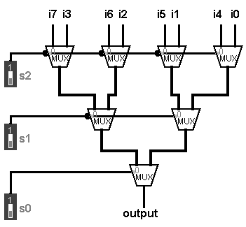
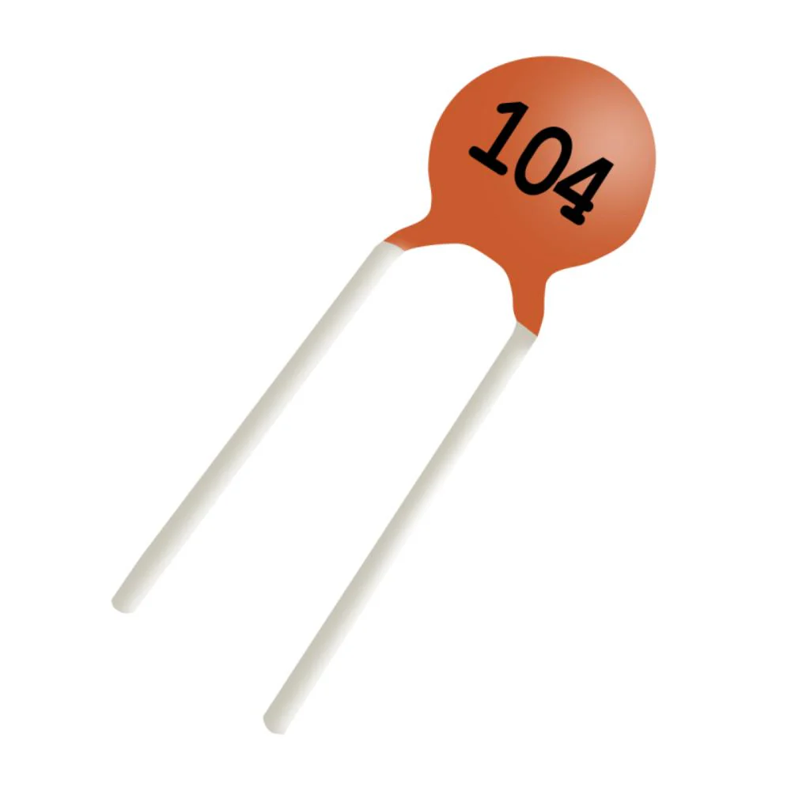

# ALU Trilogy Part Two: Breadboard Prototype

## Part Two Goal
In part one of the ALU Trilogy, which was focused on design and simulation, I designed the ALU with VHDL and verified its functionality using testbenches in Vivado and my FPGA. Because it demonstrated its intended behavior, testing was successful. Now, the design can advance to the physical world and enter the prototyping stage. This is the goal of part two. In this part, I will create a physical breadboard design for the ALU with discrete logic integrated circuits, and I will verify functionality of the completed prototype. Once a successful prototype is complete, the ALU will be ready to reach the third and final stage: a custom PCB design.

## Selecting Logic ICs
The logic behind this design is driven by logic integrated circuits (ICs) that connect to the breadboard and perform a variety of logic operations such as AND, OR, NOT, or other functions such as adding or subtracting bits or multiplexing them. So, before the design can be physically assembled, the first step is to order the proper logic components. Below is a list of the logic components I ordered:

| Part | Common Name | 
| ---- | ----------- |
| SN74HC04N | Inverter |
| SN74HC00N | NAND |
| SN74HC02N | NOR |
| SN74HC08N | AND |
| SN74HC32N | OR |
| SN74HC86N | XOR |
| SN74LS283N | Carry Lookahead Adder |
| SN74LS157N | 2x1 Mux | 

This table does not align perfectly with the list of components I used to design the ALU in VHDL in stage 1, and this is because there were a few supply issues that appeared as I searched for components online. First, I was not able to find an IC for the carry-ripple adder. Instead, I chose the SN74LS283N, an IC that features a 4 bit carry-lookahead adder. Carry-lookahead adders perform the same core function as a carry-ripple adder, only they do so faster and with more gates. Second, I was not able to find an IC for the 8x1 multiplexer that the ALU needs to select its output function. Though this initially seemed like a fatal issue with the project, I discovered a clever method for building an 8x1 mux with only 2x1 muxes that involves chaining seven 2x1 muxes together. Below is a diagram:

This design has the same functionality as the standard 8x1 mux used in this ALU. For example, setting each multiplexer's associated select line high passes its left input, so s2s1s0=111 would pass i7.

### Bypass Capacitors
Integrated circuits like the ones used in this project can switch on and off very quickly, and their switching can quickly draw current. However, because wires have inductance, the power supply may not be able to supply that current quickly enough. The solution to this problem is bypass capacitors, which are meant to supply voltage quickly in switching events like these. Each IC should usually get its own bypass capacitor, and it should be wired in parallel to the IC's VCC and GND pins. However, the capacitor's legs still have inductance like any other wire. So, the bypass capacitor should be placed as close to the IC as physically possible to minimize the distance the current needs to travel and thus minimize the time it takes to be supplied to the switching IC.

For this project, I chose to follow the datasheets' instructions and use a 0.1-μF "104" ceramic capacitor for each IC.

## Electrical Specifications
Before assembling circuits of any kind, breadboard or PCB, it is important to consider first the electrical characteristics of the components being used. For this project, the electrical specifications of the logic ICs must be respected to avoid potentially damaging them and the circuit. Though these logic ICs have many different specifications, such as recommended input voltage and supply current, they are all displayed clearly on the components' respective datasheets. Additionally, there are a few other concepts to keep in mind to ensure safe operation of ICs like these.

### Supply and Input Values and Current Draw

### Fan-Out

### HC and LS Families

## Circuit Design

## Components Used

## Assembling the Prototype

## Final Product and Testing

## Problems and Headaches

## What Did I Learn?

