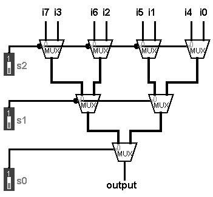
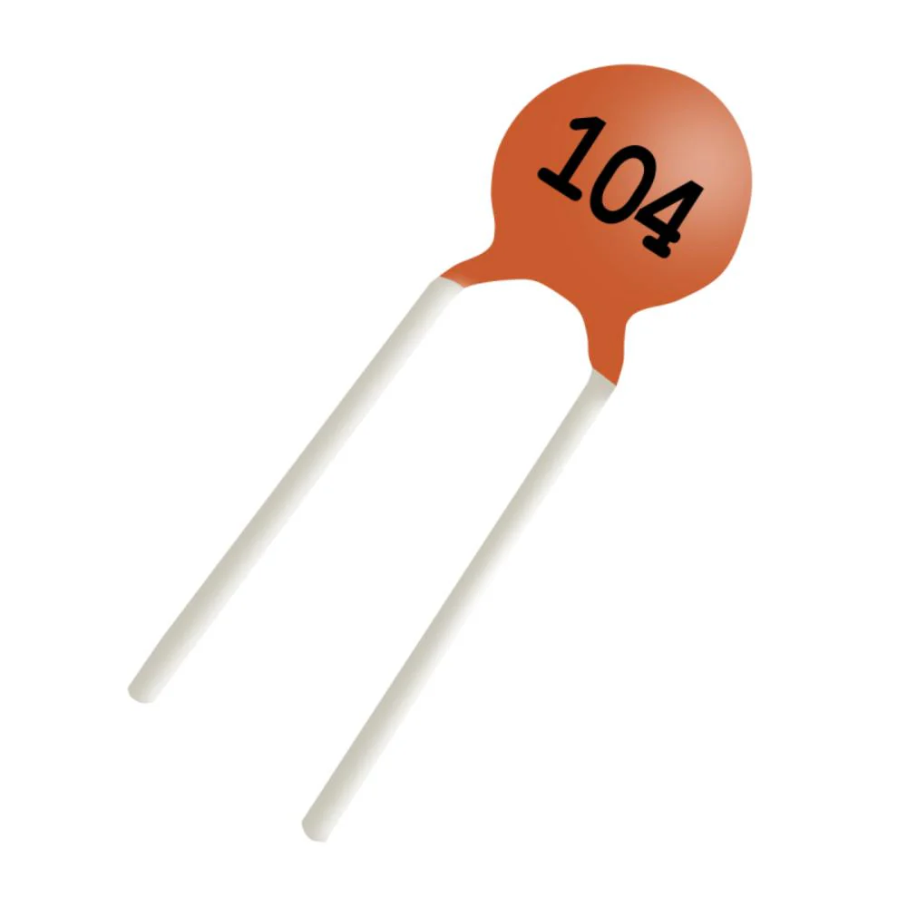
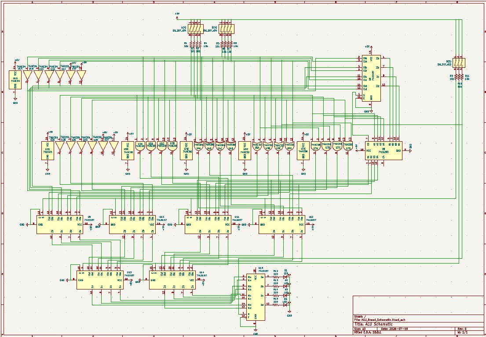
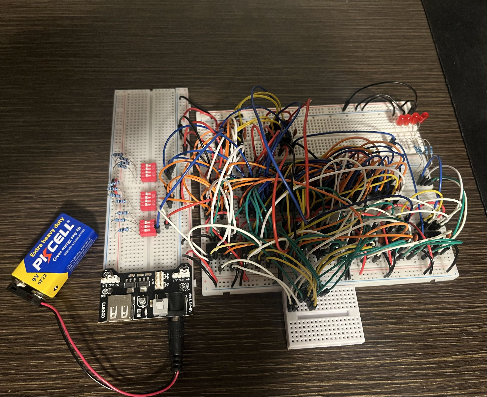
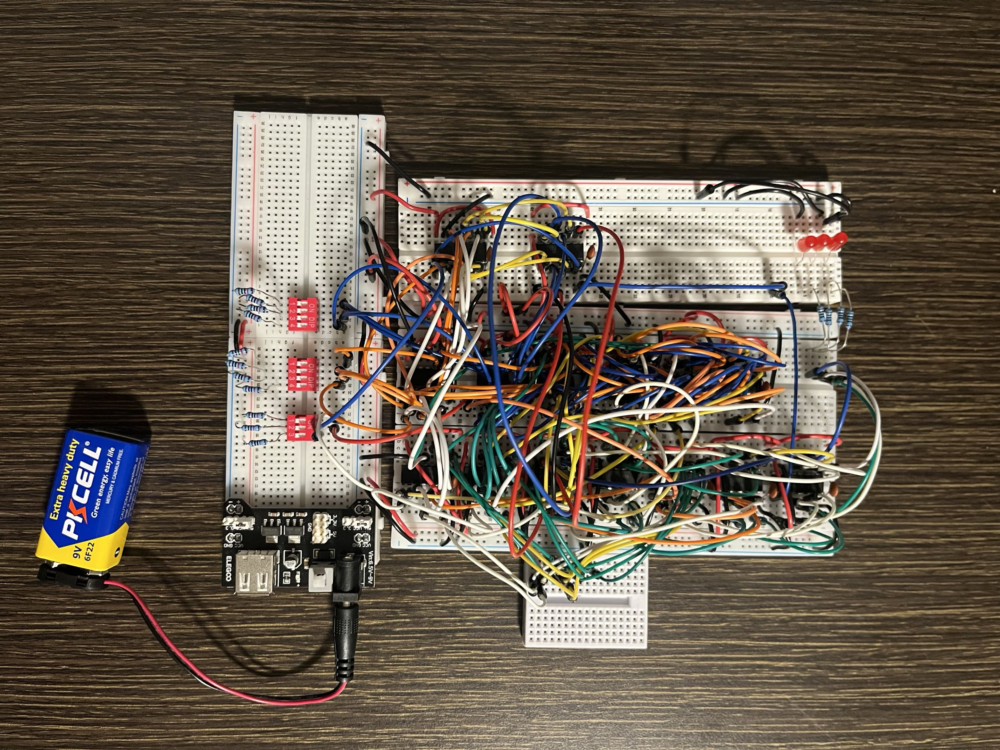
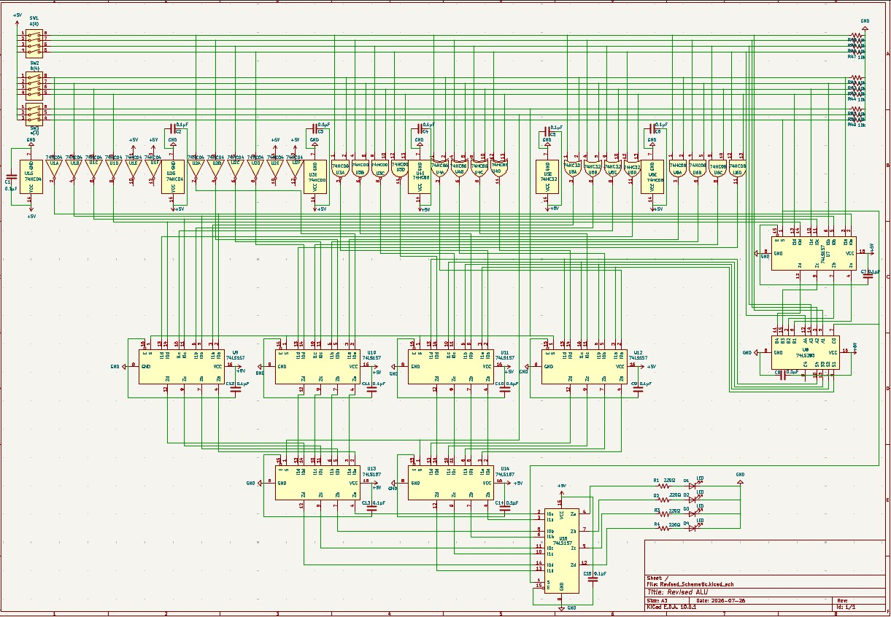

# ALU Trilogy Part Two: Breadboard Prototype

## Part Two Goal
In part one of the ALU Trilogy, which was focused on design and simulation, I designed the ALU with VHDL and verified its functionality using testbenches in Vivado and my FPGA. Because it demonstrated its intended behavior, testing was successful. Now, the design can advance to the physical world and enter the prototyping stage. This is the goal of part two. In this part, I will create a physical breadboard design for the ALU with discrete logic integrated circuits, and I will verify functionality of the completed prototype. Once a successful prototype is complete, the ALU will be ready to reach the third and final stage: a custom PCB design.

## Selecting Logic ICs
The logic behind this design is driven by logic integrated circuits (ICs) that connect to the breadboard and perform a variety of logic operations such as AND, OR, NOT, or other functions such as adding or subtracting bits or multiplexing them. So, before the design can be physically assembled, the first step is to order the proper logic components. Below is a list of the logic components I ordered:

| Part | Common Name | 
| ---- | ----------- |
| SN74HC04N | Inverter |
| SN74HC00N | NAND |
| SN74HC02N | NOR |
| SN74HC08N | AND |
| SN74HC32N | OR |
| SN74HC86N | XOR |
| SN74LS283N | Carry Lookahead Adder |
| SN74LS157N | 2x1 Mux | 

This table does not align perfectly with the list of components I used to design the ALU in VHDL in stage 1, and this is because there were a few supply issues that appeared as I searched for components online. First, I was not able to find an IC for the carry-ripple adder. Instead, I chose the SN74LS283N, an IC that features a 4 bit carry-lookahead adder. Carry-lookahead adders perform the same core function as a carry-ripple adder, only they do so faster and with more gates. Second, I was not able to find an IC for the 8x1 multiplexer that the ALU needs to select its output function. Though this initially seemed like a fatal issue with the project, I discovered a clever method for building an 8x1 mux with only 2x1 muxes that involves chaining seven 2x1 muxes together. Below is a diagram:

This design has the same functionality as the standard 8x1 mux used in this ALU. For example, setting each multiplexer's associated select line high passes its left input, so s2s1s0=111 would pass i7.

### Bypass Capacitors
Integrated circuits like the ones used in this project can switch on and off very quickly, and their switching can quickly draw current. However, because wires have inductance, the power supply may not be able to supply that current quickly enough. The solution to this problem is bypass capacitors, which are meant to supply voltage quickly in switching events like these. Each IC should usually get its own bypass capacitor, and it should be wired in parallel to the IC's VCC and GND pins. However, the capacitor's legs still have inductance like any other wire. So, the bypass capacitor should be placed as close to the IC as physically possible to minimize the distance the current needs to travel and thus minimize the time it takes to be supplied to the switching IC. Additionally, engineers should specifically use ceramic capacitors because they can supply voltage for switching ICs much quicker than other kinds of capacitors like electrolytic capacitors can.

For this project, I chose to follow the datasheets' instructions and use a
0.1-μF "104" ceramic capacitor for each IC.

## Electrical Specifications
Before assembling circuits of any kind, breadboard or PCB, it is important to consider first the electrical characteristics of the components being used. For this project, the electrical specifications of the logic ICs must be respected to avoid potentially damaging them and the circuit. Though these logic ICs have many different specifications, such as recommended input voltage and supply current, they are all displayed clearly on the components' respective datasheets. Additionally, there are a few other concepts to keep in mind to ensure safe operation of ICs like these.

### Supply and Input Values and Current Draw
A few of the most important electrical requirements for each IC in this project include supply voltage (VCC), input voltage (VI), supply current (ICC), and input current. Supply voltage and current are supplied to the IC for functionality, while input voltage and current are the data being inputted and manipulated. Importantly, input current indicates the amount of current that an IC will draw based on its behavior, not the suggested amount that should be fed to the IC at all times. So, it is important to verify that the power supply can handle the current demands of the ICs. For this project, I used a standard arduino power supply module connected to a 9v battery via barrel jack. The datasheets for each IC indicated that they all could accept 5 volts of supply and input voltage, so I configured the power supply to supply 5 volts. Supply and input current was, however, less consistent between ICs. Because they varied from IC to IC, I chose to construct an excel sheet to make analysis easier. This sheet, "ALU Components.csv", is included in this repo. It contains each logic ICs part name, common name, supply voltage, input voltage, supply current, input current, logic family, and datasheet link.

### Fan-Out
Another important electrical concern is fan-out, which describes the amount of subsequent ICs that pull one IC's output as an input. Because this requires current, it can be dangerous for one IC's output to feed into too many other inputs because they may pull too much total current for the outputting IC to handle. In this project, there are two specific instances of fan-out. First, NOT B feeds into both the 2x1 mux before the adder and the 8x1 mux. Second, the adder feeds into the 8x1 mux. Fortunately, these situations do not have an unsafe amount of fan-out, as they only include one output driving two inputs. Everywhere else in the circuit, there is one output driving one input. So, fan-out is a not a risk for this ALU, but it is an important safety concern to understand.

Inversely, it is completely safe to have a cascade-style reverse-fan-out. While it can be dangerous to have multiple inputs pulling from one output, it is completely acceptable for multiple outputs to feed into one input. This works in configurations like the alternative 8x1 mux made of 2x1 muxes shown above, where multiple ICs connect to one in the end.

### Logic Families
Logic ICs are grouped into different families based on certain characteristics. In this project, the 4-bit carry-cookahead adder IC (SN74LS283N) and the 2x1 mux (SN74LS157N) are part of the LS family, while all of the other ICs are part of the HC family. While both families retain the same general functionality, there is one difference that could have been fatal for this project: the LS mux has a high-level output voltage of 2.4-3.4 volts, and the LS adder's high-level output voltage is 2.4-3.6 volts. However, HC family ICs generally prefer high-level input voltage around 5 volts, which is the voltage chosen for this project. In other words, LS family ICs can not always produce a high-level output voltage that is high enough for HC family ICs to recognize and accept. So, it is not reliable to drive HC ICs with LS ones. Fortunately, this never happens in this project. Instead, this project only has either HC driving LS or LS driving LS. Though, it is still best to complete projects like these using ICs of a single logic family, not multiple. So, I should have ordered either only LS ICs or only HC ICs.

## Circuit Design
Below is a screenshot of the initial circuit design in KiCad. The file itself is included, too.

This design has the same core functionality of the 4-bit ALU that was designed on paper and VHDL, and it is now in a circuit schematic form to prepare for physical implementation. This time, rather than using block diagrams or code, the circuit is designed for logic ICs. So, gates show up as clusters with voltage and GND connections to represent a logic gate IC, resistors and LEDs are placed when needed, and the physical mux, adder, and switch modules are included. Furthermore, this schematic uses proper component names, such as the SN74LS157N, which appears as "74LS157" on every mux. 

To make this project as accurate to the physical components used as possible, the ALU had to be altered slightly. This is because the SN74LS157N passes input A, or i1, when the select line is low. On the other hand, I prefer to design with multiplexers that pass i1 when the select line is high. So, I flipped the inputs for each 2x1 mux in the 8x1 chain. For example, the mux that has i7 on the left and i3 on the right in the sketched design now has i3 on the left and i7 on the right on the KiCad schematic. The 2x1 mux before the adder had to be flipped, too, but this can be done simply by removing the NOT gate between s0 and the mux select rather than flipping the inputs. This saves on hardware cost and complexity while keeping functionality consistent.

Also, this design uses DIP switches to drive inputs A, B, and the select lines, each with a 10k pull-down resistor, and four red LEDs to indicate outputs, each with a 220Ω resistor.

Unfortunately, there are a few flaws to this design that must be resolved with another, improved schematic.

## Assembling the Prototype
The process of physically assembling the ALU was relatively straightforward because it was the same conceptually as designing the KiCad schematic, only physical electrical concerns such as bypass capacitors and voltage supply had to be considered. Furthermore, the logic ICs's datasheets clearly indicated the purpose of every single pin, which conceptually made wiring very easy. However, I only had three large breadboards, so I had to adjust the design to fit the limited space. Below are two pictures of the complete breadboard design.

As shown in the pictures, the wiring of this ALU is very dire, and it quickly became a challenge to navigate during design. However, the consistent organization of components despite the space constraints helped remedy this issue: the top breadboard only has the 2x1 mux and the adder, the middle breadboard has all logic gate ICs (NOT, NAND, XOR, OR, AND), and the lower breadboard has the 2x1 mux tree that acts as an 8x1 mux implemented horizontally. The first four muxes driven by s2 are on the left, which are followed by the two muxes driven by s1, followed by, on the very right, the final mux driven by s0. The outputs of this mux connect to the LEDs that indicate the ALU's output. Additionally, each IC is given a 0.1-μF bypass capacitor, and the entire ALU is powered with an arduino power supply module set to 5 volts.

## Components Used
The components used in this project are:

### Logic
 + 2x SN74HC04N
 + 1x SN74HC00N
 + 1x SN74HC02N
 + 1x SN74HC08N
 + 1x SN74HC32N
 + 1x SN74HC86N
 + 1x SN74LS283N
 + 8x SN74LS157N
 + 2x 4-wide DIP switch
 + 1x 3-wide DIP switch

### Electrical
 + 11x 10k resistor
 + 4x 220Ω resistor
 + 4x red LED
 + 15x 0.1-μF ceramic capacitor
 + Jumper wires
 + Breadboards
 + Arduino power supply module
 + 9v battery

## Testing
Unfortunately, the breadboard design did not function correctly. Rather, the LEDs glowed unpredictably, and flipping the switches did not always result in a predictable outcome. After investigating and researching, I discovered two problems with the design: first, there was a broken wire. Second, I fundamentally misunderstood pull-down resistors, which caused me to implement them incorrectly. Initially, I thought pull-down resistors had to be placed in series between a switch and an input it is connected to. I thought that, that way, stray floating voltage when the switch is open would result in a negligible current because of the immense (10k) resistance due to Ohm's Law, which would cause the IC to detect low (0) voltage exactly as intended. However, that is not correct.

Instead, pull-down resistors should be connected to GND in parallel with the intended IC input. For example, one switch driving one input would be connected to two parallel branches: the first would be the pull-down resistor and GND, and the second would be the IC. This way, when the switch is open, there is a clear low-voltage (0) signal coming from GND, rather than unpredictable stray voltage due to the open switch.

Unfortunately, I discovered these causes only after dissasembling the breadboard design. However, I have created a revised schematic that features the proper revisions.

## Improved Schematic
This improved schematic now features better structure and organization, proper placement of pull-down resistors, and bypass capacitors are included.

## Problems and Headaches
Completing this project came with many obstacles, some physical and some digital. First, I came into this project with no prior KiCad experience at all. So, the obstacles and confusion that emerged as I learned KiCad made the process of designing the ALU this way quite slow and cumbersome. I often had trouble finding the correct components, manipulating them correctly, or navigating the KiCad interface.

As for physical problems, there were many. Ordering components was difficult and problematic, as the logic families for my ICs did not all match, and I could not find an 8x1 mux to order. So, I had to combine seven 2x1 muxes to create a makeshift 8x1 mux, and I had to carefully navigate datasheets to verify that the LS and HC logic ICs in this project would interact together correctly. Further, I initially did not have enough wires, breadboards, or resistors, so I had to source more. I also never assembled a circuit this complex before, so it was a difficult and slow process. This was worsened by the fact that logic ICs and DIP switches were completely new to me, I had never used ceramic capacitors before, and I did not fully understand pull-down resistors. So, the final design was, unfortunately, unsuccessful.

## What Did I Learn?
Fortunately, failures like these are good because they can become excellent learning experiences if interpreted correctly. Furthermore, I have found that projects with many problems and headaches often serve as better learning experiences than those without. So, I learned a huge amount of information by completing this project.

First, my grasp on hardware has expanded significantly, and this was the first time I had interacted with digital design concepts in the physical world outside of FPGAs. Breadboarding this ALU helped me gain a much better understanding of physically assembling and wiring circuits in the real world, it helped me conceptually understand pull-down resistors, and I learned about bypass capacitors and why they are important. Furthermore, this project taught me about logic ICs and their electrical characteristics such as how logic families (HC and LS) behave electrically and interact with each other, fan-out current, how to read their datasheets, how to properly include them in a circuit (bypass capacitors, proper voltage and GND connections), and how to use them together to achieve the intended ALU behavior. In fact, the process of using these logic ICs to translate my VHDL and sketches for my ALU into a physical breadboard design was a very interesting and informative experience.

Next, my learning KiCad for this project is quite helpful for my skillset as an engineer. Though learning KiCad was quite difficult and time-consuming, understanding how to design physical circuitry is an essential skill for electrical engineers, and the ALU breadboard has helped me gain important experience with this.

Also, this project does not exist in a vacuum. Rather, it is the second part in a series of three. It is a natural continuation of my prior FPGA design and a necessary precursor to the final stage of the ALU design, which is a custom PCB. The greater goal of this project is practicing the engineering design process of simulation (FPGA), prototyping (Breadboard), and final design (PCB), and it was useful and informative to complete this project, the prototyping stage, with that in mind.
