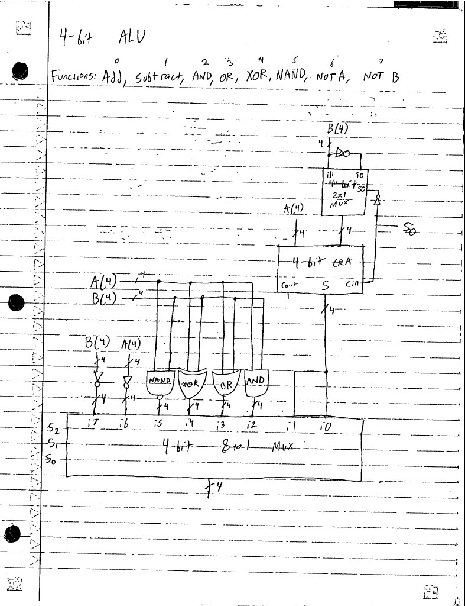
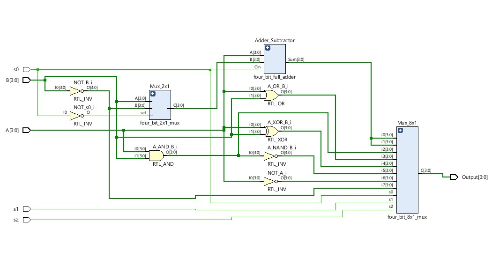

# ALU Trilogy Part One: FPGA

## Part One Goal
The first step of this project, and the goal of part one, is simulating the ALU on an FPGA, which must be done to ensure functionality before developing a physical prototype. To do this, I must first make the block diagram and truth table for the ALU, and then I must write the VHDL required to simulate it on the FPGA.

## What Is an ALU?
An arithmetic logic unit, ALU, is a combinational digital logic circuit that performs mathematical operations such as addition and subtraction as well as logical operations such as AND, OR, NOT, etc. Computers use ALUs to do math and make decisions similar to how humans use calculators, and they can range from being very small and simple to being large and complex. Though ALUs can be designed to perform a variety of functions and use inputs of many different sizes, they usually terminate with a multiplexer to select one function at a time.

## How Does the ALU Work?
The ALU in this project is designed to receive two four-bit inputs: A and B, and perform eight different operations on them, each corresponding to a multiplexer select line: NOT B (i7), NOT A (i6), A NAND B (i5), A XOR B (i4), A OR B (i3), A AND B (i2), A - B (i1), and A + B (i0). Additionally, there will be three select lines, s2, s1, and s0 for the four bit 8x1 multiplexer at the end of the ALU. The addition and subtraction functions, s2s1s0 = 000 and s2s1s0 = 001 respectively, will be handled by a single carry-ripple adder, which will be configured to add or subtract based on the value of s0. This will be done by connecting A directly to the adder and connecting B to a 2x1 multiplexer whose output connects to an adder. The 2x1 mux passes either B (i1) or its complemented form (i0) based on the select line, s0, and the carry-in of the adder is also connected to s0. This means that when s2s1s0 = 000 is selected, the carry-in of the adder is set to 0, and the select line of the 2x1 mux is set to 1, passing B. Then, A and B are simply added together. When s2s1s0 = 001, however, the carry in of the adder is set to 1, and the select line of the mux is set to 0. This passes the complemented form of B, which is added to A and the carry-in of 1. In this case, adding A, B', and 1 is mathematically identical to adding A to B in two's complement form. In fact, this is how subtraction is usually done with binary numbers, and this system automatically computes the two's complement of B to perform subtraction.

### Truth Table
| s2 | s1 | s0 | Operation | Mux |
| -- | -- | -- | --------- | --- |
| 0 | 0 | 0 | A + B | i0 |
| 0 | 0 | 1 | A - B | i1 |
| 0 | 1 | 0 | A AND B | i2 |
| 0 | 1 | 1 | A OR B | i3 |
| 1 | 0 | 0 | A XOR B | i4 |
| 1 | 0 | 1 | A NAND B | i5 |
| 1 | 1 | 0 | NOT A | i6 |
| 1 | 1 | 1 | NOT B | i7 |

### ALU Design
Below are some schematics for the ALU

## Vivado and VHDL
It is essential to simulate a design to ensure desired functionality before physically prototyping it, and this is done with software and code. For digital design projects specifically, a special type of programming language called a hardware description language (HDL) is used. Two of the most popular HDLs are VHDL and Verilog, and this project uses the former. Further, the VHDL for this project is written inside an integrated design environment (IDE) called Vivado, which is useful because it provides engineers an enviornment for writing HDLs such as Verilog and VHDL, and it allows engineers to simulate their designs. Vivado is also compatible with the FPGA used in the project, the Digilent Basys 3, making it quick and easy to flash code to it for testing.

## Coding the ALU
After designing the truth table and block diagram for this ALU, it is time to write the VHDL for it in Vivado. Because this circuit uses several different components, it is best to take a hierarchical approach and design the components independently before using them as building blocks for the final ALU. The adder is designed first, followed by the 2x1 multiplexer, then the 8x1 multiplexer, and then the final ALU is assembled.

### Building and Simulating the Adder/Subtractor
When planning this project, I specifically chose to implement a four bit carry-ripple type adder instead of other, potentially hastier types of adders because designing this component is its own exercise in hierarchical design. Since a four bit carry-ripple adder is simply built from connecting four one bit full adders, the first step was to design a single one bit full adder. This full adder, called "fulladder" was designed with structural architecture, and building the final four bit full adder only requires four instances of this newly built adder. This is the advantage of hierarchical design. For this four-bit carry ripple adder, it is substantially quicker to design a signle one bit adder and instatiate it four times rather than coding the entire four bit full adder from scratch. So, the final four bit carry ripple adder, called "4bit_full_adder", was built with structural architecture and four instances of "fulladder" rippled together. Though the four bit full adder is complete, it cannot yet reach its full intended addition/subtraction capabilities because it is missing the multiplexer to pass B or its complement depending on the value of s0.

However, it is still useful to simulate the four bit full adder and verify functionality before moving on to the 2x1 mux. Simulating this component can be done entirely within Vivado, and it requires a testbench file, which describes the procedure for testing. I called this one "four_bit_full_adder_tb". This testbench file, like the design source for the adder, is still a .vhd file, so it must be programmed in VHDL. I tested the four bit full adder by using loops to compute the result of every possible combination of inputs and comparing this to an expected value, also computed automatically in the loop. If there are zero discrepancies between the expected and actual values, then the reports "TEST DONE!" to indicate a success. If a failure is detected, the program stops early and reports the A, B, and carry in values that were present at the failure. Though testing can also be done manually by reading waveforms, it is much more efficient to design a program such as this one. 

### Building and Simulating the 2x1 Multiplexer
To complete the addition/subtraction mechanism, there must be a four bit 2x1 mux implemented to pass B or B' to the adder based on the value of s0. So, I made a design source file for the four bit 2x1 mux and called it "mux_2x1_4bit.vhd". Because this multiplexer only required two inputs and one select line, programming it was very quick. In fact, the architecture section only required one line: 
C   <= A when (sel='1') else B;

Next, I created testbench file "mux_2x1_4bit_tb.vhd" to test the mux. Like that of the four bit full adder, the procedure of this testbench file involved comparing expected values to actual ones. However, there was no need this time to test every single combination of A and B. Instead, A and B were set to arbitrary values and the actual output of the mux was compared to the expected output for both possible s0 values, 0 and 1. Like the adder's testbench file, this one uses two if statements, one per s0 value, to detect whether the actual and expected values align. If they do not, the program ends early and reports the inputs and outputs present at the failure. If both cases pass, then the program reports "TEST DONE!" to indicate a success.

### Building and Simulating the 8x1 Multiplexer
With the addition and subtraction system complete, the next step is to design the four bit 8x1 multiplexer that selects the function the ALU will output. I called this file "four_bit_8x1_mux.vhd" This mux required more lines of code to accomodate the increased inputs and select lines, but its underlying logic was similar to that of the 2x1 mux.

However, this mux required a slightly more sophisticated testbench process to be efficient. The testbench file, called "mux_8x1_4bit_tb.vhd", used constant input values and a for loop to compute the result of every possible combination of s2s1s0 values. Crucially, the nth input has decimal value n in this testbench file. So, i3, for example, is 0011, which is a decimal value of 3. Since the for loop uses "i" for its iterator, the expected value can simply be set to i in 4-dimension vector form. This means that the nth iteration should pass n. This system makes it extremely easy to compute the expected value, which is compared to the actual value for each iteration. Like the last two components, the program ends early if there is a failure detected, and it reports the select value and the actual output. If no failures occur, the program reports "TEST DONE!" to indicate a success.

### Final Product
With the adder and both multiplexers complete, only logic gates remain in the ALU, and these are not significant enough to deserve their own design source files. So, the final ALU file can be created by assembling the proper components and logic gates with VHDL. I called this file "ALU_4bit" and built it with behavioral architecture. This ALU will technically be built using both structural and behavioral architecture, which is often called "Mixed" architecture, but I selected "behavioral" because it is Vivado's default architecture and allows any kind of architecture to be used.

Similar to the way that the four bit full adder calls four instances of the one bit full adder that came at the outset of this project, the ALU will call an instance of the four bit full adder and both muxes. Within the architecture section, I delcared signals NOT_B, NOT_A, A_NAND_B, A_XOR_B, A_OR_B, A_AND_B, B_mux_out, sum_or_diff, and NOT_s0, which represent the logic gates for inputs i2-i7, the output of the 2x1 mux that passes B or B', the output of the adder/subtractor, and the signal s0' that feeds into the select line of the 2x1 mux. After including the logic gates and instantiating the proper entities, those being the adder/subtractor and the two muxes, and establishing their port maps, the ALU was complete in a single design source. Within Vivado, I set the ALU as the top file to indicate that it is the primary actor in this project and the other design sources are like its building blocks. This is important to ensure proper compiling and functionality.

## Constraints File and Flashing to the FPGA
Though the ALU design source is finished, I cannot flash it to the FPGA without a constraints file to specify how the inputs and outputs of the ALU correspond to the switches and LEDs on the FPGA. So, I wrote a contraints file and included that A corresponds to switches W13, W14, V15, W15, and B corresponds to switches W17, W16, V16, and V17. Further, s2s1s0 each correspond to switches R2, T1, and U1, respectively, and the outputs correspond to LEDs V19, U19, E19, and U16. Now, using a USB-A to micro USB cable, I can flash the design to my FPGA to begin testing.

## Testing
Now that the ALU has been successfully flashed to the FPGA, physical testing can begin. First I will start by setting A equal to 2 (0010) and B equal to 1 (0001) and selecting all eight different functions of the ALU. This is done with the array of switches at the bottom of the ALU, and the outputs will appear on the four rightmost LEDs above the switches.

This was a successful test as all outputs were correct. Next, I will test with A = 1 (0001) and B = 5 (0101).

This was a successful test. Note that the output corresponding to s2s1s0 = 001, which represents A minus B, is 1100 in binary. This is -4 represented in two's complement, which is the correct output. For addition or subtraction in this ALU, the most significant bit in input data and output data represents the sign bit. An MSB of 0 indicates a positive number, while an MSB of 1 indicates a negative number. So, any input value greater than 7 (0111) would be interpreted as negative because of the sign bit.

## What Did I Learn?
This project was my first step into digital design beyond standard coursework, so there was a very steep learning curve. I came into this project completely inexperienced with FPGAs and Vivado, and my VHDL was quite rusty. So, I learned a lot. First, this project helped me gain valuable experience with Vivado as I reviewed hierarchical design and grasped the concepts of design sources, simulation sources (testbenches), and constraints files. My work within Vivado also helped me review and improve in VHDL, and this was my first experience with using a testbench file rather than verifying functionality with a waveform. I also learned the basics of how to operate an FPGA and test a design effectively using its switches and LEDs and observe and interpret the outcomes. Fortunately, I came into this project familiar with the digital logic conceptual framework, so designing the ALU and understanding it was no problem. This allowed me to focus more closely on sharpening my VHDL skills and gaining a better understanding of Vivado and FPGAs. Though I now am only finished with the first phase of this project, I have successfully gained the knowledge and experience I need to proceed to the next part.
