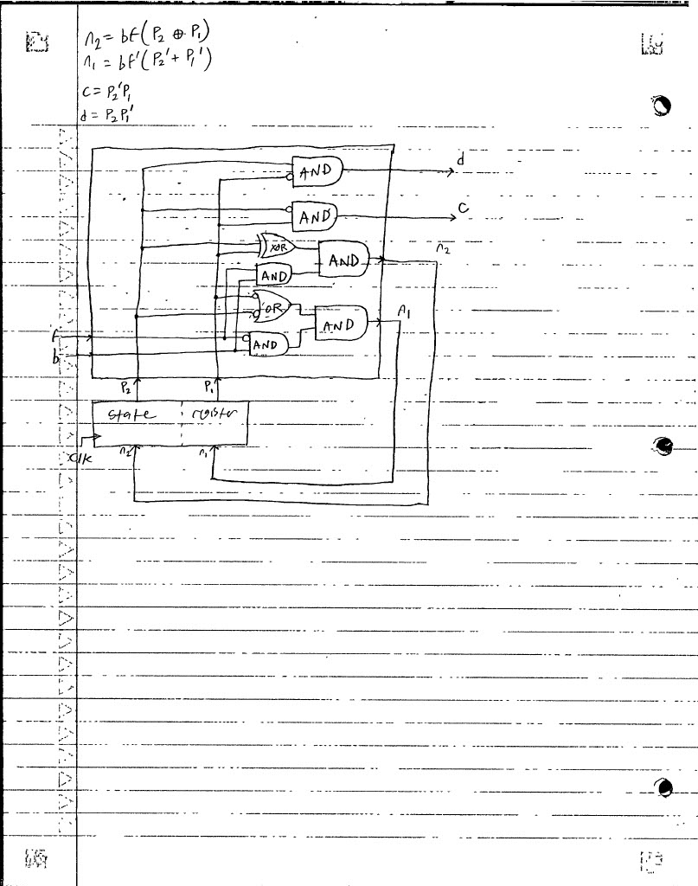
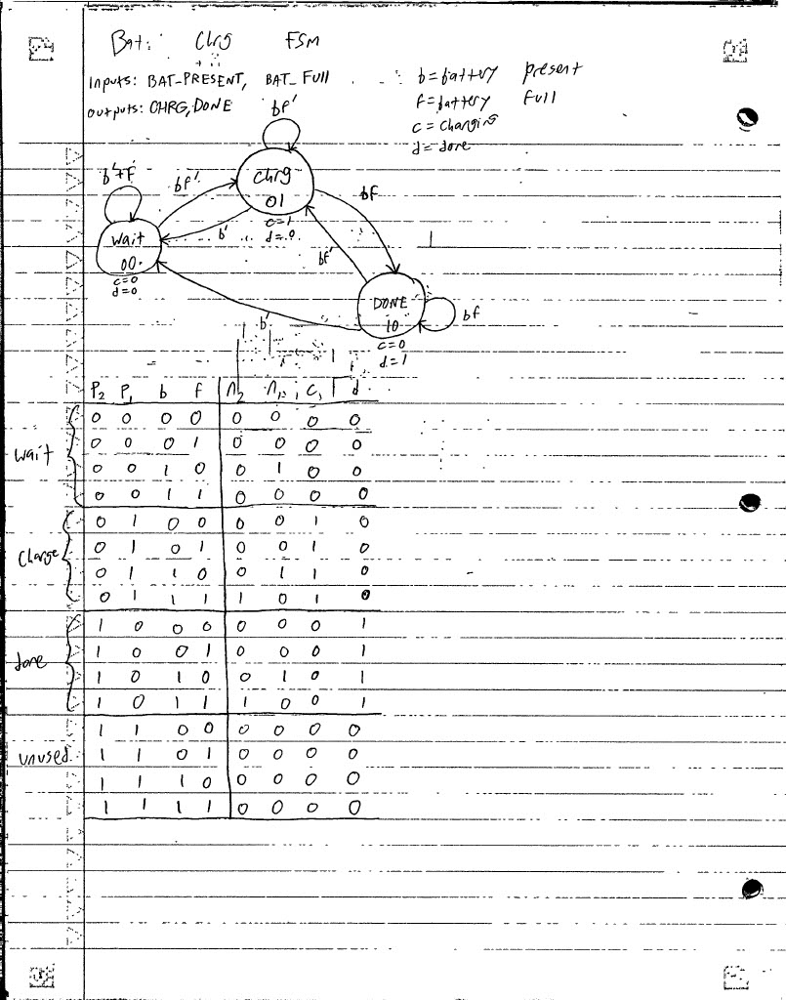
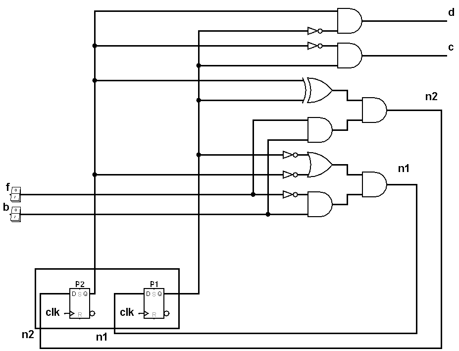
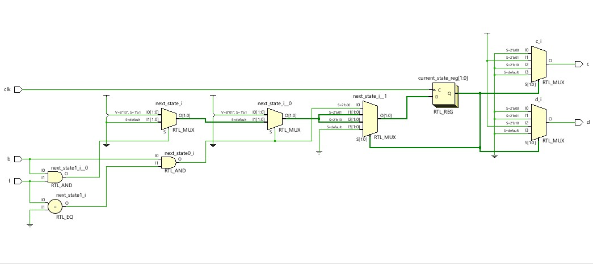

# FSM Battery Charger

## Project Goal
The goal of this project is to sharpen my VHDL and digital design skills and deepen my understanding of Vivado and FPGAs by implementing an FSM based on the logic of a battery charger. This project includes sketching the state driagram, truth table, and corresponding circuit of the FSM, building the FSM with VHDL in Vivado and, finally, testing it on my FPGA.

## FSMs and Sequential Logic
There are two types of logic used in digital logic design: combinational logic and sequential logic. Combinational logic describes an output that depends solely on the current inputs, and there is no element of memory. An ALU, for example, is purely combinational. Sequential logic, on the other hand, incorperates memory and describes an output that may depend on a history of inputs. Sequential logic, like combinational logic, is essential for modern technology, and the two logic types often appear together. Sequential logic often appears as SR latches, D-latches, D-flip flops, or registers. Registers are particularly useful for sampling data, storing it, and then supplying it. To do this effectively, they are connected to a clock so that they operate on an interval. As the clock oscillates periodically between high and low, registers sample data the moment a clock transitions from low to high, called the "rising edge". This data is stored and supplied continuously until it is overwritten by a different value at another rising edge of the clock. A register is said to be "synchronous" because it operates with a clock.

One important application of sequential logic is the finite state machine, FSM, which is a type of digital circuit that incorperates a combinational element, a controller, and a sequential element, a register. Based on the history of combinations of inputs, FSMs move between a finite number of states synchronously with the clock. FSMs are useful in a variety of modern electronics such as vending machines and elevators, whose behavior depends on a sequence of inputs. This project uses the FSM of a battery charger.

## How Does It Work?
One of the very first steps of designing an FSM is drawing the state diagram, which is a collection of circles and arrows that illustrates the various numbered states of the FSM, their outputs, and the conditions to move between them or remain at a state. States are denoted as circles, while arrows represent the possible paths to and from a state. This FSM waits to receive a battery in the `wait` state, charges it in the `chrg` state if the battery is connected and not fully charged, and it stops charging if the battery becomes full or is removed. If the battery is removed before charing is complete, the circuit returns to the `wait` state. If the battery remains but becomes fully charged, the circuit enters a `done` state where it waits for the battery to either be removed or need charging again. If the battery is removed, the circuit returns to the `wait` state. If the battery loses charge and needs to be recharged, the circuit returns to the `chrg` state. 

It is important to label the states in binary to make the truth table easier to construct and interpret. `wait` is labelled 00, `chrg` is labelled 01, and `done` is labelled 10. Further, there are inputs b and f, which represent whether the battery is present and whether it is full, respectively. There are also outputs c, which represents charging and is only high at state `chrg`, and d, which represents whether the charging is done and is only high at state `done`.

`wait` is the starting state, and the FSM can only move to `chrg` from here if b is 1 and f is 0. This is denoted by drawing an arrow from the `wait` state to the `chrg` state with bf' drawn above it. Alternatively, the FSM remains at `wait` if b is low or f is high. This is denoted by a circular arrow starting and ending at `wait` with b'+ f written above it. From `chrg`, there are three paths. b' returns to `wait`, bf' loops back to `chrg`, and bf moves to `done`. From here, bf' goes to `chrg`, bf loops back to `done`, and b' returns to `wait`. 

## Truth Table
| P2 | P1 | b | f | n2 | n1 | c | d |
| -- | -- | - | - | -- | -- | - | - |
| 0 | 0 | 0 | 0 | 0 | 0 | 0 | 0 |
| 0 | 0 | 0 | 1 | 0 | 0 | 0 | 0 |
| 0 | 0 | 1 | 0 | 0 | 1 | 0 | 0 |
| 0 | 0 | 1 | 1 | 0 | 0 | 0 | 0 |
| 0 | 1 | 0 | 0 | 0 | 0 | 1 | 0 |
| 0 | 1 | 0 | 1 | 0 | 0 | 1 | 0 |
| 0 | 1 | 1 | 0 | 0 | 1 | 1 | 0 |
| 0 | 1 | 1 | 1 | 1 | 0 | 1 | 0 |
| 1 | 0 | 0 | 0 | 0 | 0 | 0 | 1 |
| 1 | 0 | 0 | 1 | 0 | 0 | 0 | 1 |
| 1 | 0 | 1 | 0 | 0 | 1 | 0 | 1 |
| 1 | 0 | 1 | 1 | 1 | 0 | 0 | 1 |
| 1 | 1 | 0 | 0 | 0 | 0 | 0 | 0 |
| 1 | 1 | 0 | 1 | 0 | 0 | 0 | 0 |
| 1 | 1 | 1 | 0 | 0 | 0 | 0 | 0 |
| 1 | 1 | 1 | 1 | 0 | 0 | 0 | 0 |

Note: the unused state P2P1 = 11 is specifically designed in this truth table to produce all zeros in the output side of the truth table. This way, if the circuit glitches and somehow ends up at state 11, it will be sent to state 00 with the outputs reset. Though there is no reasonable way to land on state 11 because it is completely unused, it is useful to design safeguards against possible bugs such as this one.

## State Diagram and Circuit
Below is the state diagram, truth table, and circuit schematics

Below is a schematic I made with a software called Logisim Evolution

## Coding the FSM
Coding the FSM went relatively straightforwardly, as there was no element of hierarchical design needed here. I started by creating the design source file called "FSM.vhd" with behavioral architecture. Within the file, I defined ports f and b as inputs, c and d as outputs, and clk as the input for the clock. Then, in the architecture section, I established the signals `current_state` and `next_state` as two-dimensional vectors so that they can be set to states 00, 01, or 10. Next, I established the wait state, called `WAIT_ST` as the two-dimension vector 00, `CHRG_ST` as vector 01, and `DONE_ST` as 10.

Next, I built the sequential behavior of the circuit by creating an if statement that changes `current_state` to `next_state` at the rising edge of the clock. This if statement inside `process(clk)` in the VHDL is all that is needed to make the FSM synchronous.

After that, I wrote the combinational behavior. I began by definiting the starting state, `WAIT_ST` and the associated outputs. Then, I created a when statement for each state followed by its associated outputs, and I attached an if statement to each when statement that accounts for all possible paths away from the state based on b and f. The if statements do this by setting `next_state` equal to one of the three possible states.

## Constraints
With the design source file complete, only the constraints file remains before the FSM can be flashed onto the FPGA and tested. I called the file "FSM_Pins.xdc", and I set inputs f and b equal to switches V17 and V16, respectively. Then, I connected outputs d and c to LEDs U16 and E19 respectively. Finally, I synchronized the clock to the FPGAs W5 pin, and I set the frequency to 100MHz, or a period of 10 nanoseconds. I used `-waveform {0 5}` to describe when the rising edge occurs in the period, at 0 nanoseconds, and when the falling edge occurs, at 5 nanoseconds.

## Testing
After successfully flashing to the FPGA, I began testing with f and b set low. First, I set f high and observed that the state did not change from `wait`, as intended. This makes sense because f=1 and b=0 represents a battery that is full but not placed in the charger. Then, I set b high as well, which still did not change the state. This represents a fully charged battery in the charger, so the circuit is neither charging nor done because it never began. Importantly, setting b=f=1 at `wait` causes no LEDs to illuminate, indicating that the current state is still `wait`. Then, I reset both states to 0 and set only b high. At that point, the LED corresponding to c illuminated to indicate that the state had moved from `wait` to `chrg` exactly as expected, which represents an empty battery being placed in the charger and charged. Because bf' is the condition to stay at `chrg`, the behavior of the FSM was easy to observe and document as nothing changed as time passed with b high and f low. Next, while keeping b high, I set f high to simulate the battery becoming charged. As expected, c's LED went low because charging finished, while d's went high to indicate that charging is done. This is exactly the expected behavior, and the circuit remained this way as long as b=f=1, as intended. Note that here, at state `done`, b=f=1 illuminates d's LED, while this same combination of inputs illuminates no LEDs at state `wait`. Then, I kept b high and set f low again and observed the FSM move back to `chrg`, as expected, then I set f high again and observed the circuit return to `done`, again as expected. After that, I switched both switches off to simulate the battery being removed and becoming empty, and the circuit again demonstrated the intended behavior by returning to `wait`. Finally, I tested the last possible path the FSM could take by setting b high and f low to enter the charging state, and I set b back low to leave it instead of continuing to `done`. This was successful, and testing the FSM was a complete success. The FSM is fully functional exactly as intended.

https://github.com/user-attachments/assets/dcc40b0d-5643-47ff-82d3-886177530b45

## Alternative FSM Design
Shortly after testing, I opened the elaborated design in Vivado expecting to see a circuit that looked similar to my design. Instead, Vivado generated a design that looked nothing like mine.

Instead of a state register and a controller made up of some logic gates, I saw a state register and an array of muxes. I initially thought that this was incorrect and created by a glitch because I had never seen an FSM designed like this, but I investigated and learned that this is, in fact, a perfectly valid way of designing an FSM. This array of muxes is Vivado's interpretation of the `case` block in VHDL and various if statements. The 4x1 mux on the far right feeding into the state register represents the `case` statement, and the preceding muxes represent the if statements that, based on the inputs, dictate the inputs of the 4x1 mux. The 4x1 mux's two bit select line is the output of the state register, which is the two bit ID of the current state (00, 01, or 10). The unused state 11 is accounted for by the "S=default" line on the 4x1 next state mux. `next_state` is passed onto the register so that, as intended, it becomes `current_state` at the rising clock edge. The two 4x1 muxes on the far right dictate the outputs, and their select lines are driven by the current state. The specifics of this design are beyond the scope of this project, but this design is logically identical to the one I created.

## What Did I learn?
This project significantly sharpened my VHDL skills, as I did not know very well how to implement sequential logic in VHDL before this, and I was mostly unfamiliar with using it to design FSMs. Furthermore, implementing this project helped me improve my familiarity with Vivado, VHDL, and my FPGA. I also learned how to use a new software, Logisim Evolution, to create the gate-level design for my FSM that I included in this project. It was useful to take inspiration from real-world technology, battery chargers, to design the logic of my FSM rather than using arbitrary desired outputs, and this real-world correlation helped me design the logic behind the circuit. Furthermore, the fascinating FSM design Vivado generated completely revamped the way I see FSMs and their designs, and I look forward to exploring this approach in future projects. Overall, this was a great review of digital design concepts I had already learned as well as a highly beneficial learning experience that deepened my understanding of VHDL, Vivado, FPGA use, and FSM design.
