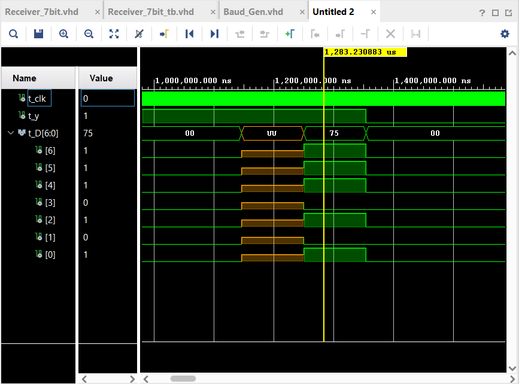

# Valmis Mk. 2

## Project Goal
Now that the UART transmitter is finished, the natural next step is to begin designing the receiver. So, this is the project goal. The workflow for this project will be very similar to that of the transmitter. First, I will sketch the design's HLSM. Then, I will use this to design the datapath. Next, I will sketch an FSM for the controller, and, after that, I will design the controller. Finally, I will sketch a final design for the receiver with a datapath and controller. After finishing the sketch designs, I will translate these into VHDL with Vivado. There will be a .vhd file for the datapath, the controller, the final receiver design, and I will reuse the baud rate generator from the transmitter, too. This way, the receiver will be designed around the exact same baud rate that the transmitter uses, which will make them easier to combine in Valmis 3. Finally, I will flash this design to my FPGA for physical testing. This time, instead of using my FPGA to transmit information to a PuTTY terminal on my computer, I will use the PuTTY terminal to transmit information to my FPGA. Because the Basys 3 FPGA lacks a display, I will map each bit of the received ASCII value to an LED above the FPGA's switches. This will allow me to verify visually whether my receiver properly received the ASCII value I sent from the PuTTY terminal.

## Sketch Design
With the project goal identified, the next step is to begin sketching.

### HLSM
First, I began by sketching the HLSM. I included one input, y, and one output, D. Because a UART transmitter transmits data one bit at a time, the receiver's input, which is the same thing as the transmitter's output, is one bit. The output, D, stands for "Display", and it will be used to display the received 7-bit ASCII value on the FPGA's LEDs. 

I included four states: INIT, WAIT, RECEIVE, and SHOW. INIT, short for "initialization", is the initial state, represented by 00. From INIT, the HLSM only moves to the next state, WAIT, if it receives `y = 1`. I put this in place as a safeguard against invalid idle behavior coming from the transmitter. At WAIT, state 01, I introduced and set variable `N = 0`, and output `S = 0`. Variable N functions similar to how I does in the transmitter; it increments while data is being received, and a comparator fires when it has exceeded a certain value. This is used to indicate to the controller that the desired ASCII value is done being received. Just like I, I chose 6. S, on the other hand, stands for "show". For now, `S = 0` causes the output D to be equal to `000 0000`, and a high S causes D to become the ASCII value received. S will become more important when I begin to design the datapath.

From WAIT, `y = 1` causes the HLSM to loop back to WAIT, while `y = 0`, the start bit, will cause the HLSM to move to the RECEIVE state, state 10. Here, it will begin to store the y values that come from a transmitter. At RECEIVE, there is only one function, `N = N + 1`. So, N will increment while data is being received. The HLSM will loop back to RECEIVE if N is less than or equal to 6, and it will move to the next state, SHOW (state 11), if N is greater than 6. At SHOW, `S = 1` and N returns to 0. At this state, the output D will change from `D = 000 0000` to the ASCII value the receiver stored. From SHOW, the HLSM will only move back to RECEIVE if it detects another start bit, `y = 0`. Otherwise, it will loop back to itself if `y = 1`.

 - Include picture

### Datapath
Next is the datapath, and the most significant hurdle that I faced while designing this UART receiver's datapath was figuring out how to convert a series of seven 1-bit inputs into one parallel 7-bit word. After some deliberation and planning, I decided to try what I call a "trickle-down" design that uses a cascade of seven registers. At the very top of the cascade, there is register 6, which I labeled "R6". R6 connects to R5, which connects to R4, and this pattern continues until it reaches R0. Additionally, all 7 registers share the same baud rate and load signal. I initially included a separate load signal for each register in the cascade, but I later changed this to the signal ld_c, which all of these registers share.

For example, suppose a 3-bit UART receiver using my "trickle down" configuration is receiving a 3-bit input 101. First, it would receive `y = 1` after the start bit. So, the top register, R2, would be loaded with `y = 1` when the rising baud edge comes. R1 and R0 remain undefined. At the next rising baud edge, the transmitter would send `y = 0` to the receiver. All of the registers in the chain would load again, so the new value of R2, `y = 1` would be loaded to R1. In other words, R2's value "trickles down" to R1. At the same time, R2 is overwritten with its new value, `y = 0` because all the registers have loaded again. Finally, the transmitter sends `y = 1`. All of the registers load, so R1 trickles down to R0, R2 trickles down to R1 and overwrites its old value, and the final bit, `y = 1`, is loaded to R2. With that, the receiving process is complete.

This same process takes place in my 7-bit receiver, only with 7 registers instead of 3. Additionally, each register also connects to its corresponding bit position in a large 7-bit register I called the "SEND register", which is meant to store the entire received 7-bit ASCII value as one word in one place rather than fragmented across 7 separate registers. Additionally, the stored ASCII value in the SEND register will persist as the trickle-down registers are overwritten when new data is received. The SEND register is also connected to the same baud rate as all the other registers, but it has its own load signal, called t_ld, which stands for terminal load. In the SHOW state, t_ld will go HIGH, and the SEND register will take on the value of the 7 registers in the cascade above it. Simultaneously, it will begin to output, or, "SHOW" this value. Later on in the development of this project, I discovered that the SEND register was not only redundant, but problematic.

Also, I decided to implement a safeguard in this datapath that ensures D is always equal to `000 0000` unless the receiver enters the SHOW state. I did this by adding a chain of 7 AND gates at the end of the receiver, one for each output of the SEND register. Each AND gate connects to its corresponding SEND register output and S, which is an output of the controller that goes HIGH in the SHOW state. The output of these 7 AND gates combined is D. So, when the receiver is not in SHOW state, every AND gate outputs a 0. So, `D = 000 0000`. In the SHOW state, all bit positions of the received ASCII word that are meant to be 0 remain 0, while those that are meant to be 1 become 1. This ensures that the received ASCII value is only displayed in the SHOW state, nowhere else. Further into designing this project, I discovered that S can be replaced with t_ld, saving on design complexity, wires, and gates.

- Include pic

The loop for incrementing N shares the exact same structure that is used for I in the transmitter. It starts with a 2x1 mux for N driven by N_sel, which comes from the controller. When N_sel is LOW, the mux passes i0, which is 000. When N_sel is HIGH, the mux passes i1, which is N + 1. The output of the mux feeds into the N register, which is loaded by N_ld, which again comes from the controller. Additionally, the N register is connected to the same baud rate as the register cascade. The output of the N register arrives at two separate destinations: a comparator and an incrementer. The comparator's output, Ngt6, is only HIGH when N is greater than 6. Ngt6 is an input to the controller. On the other hand, the output of the N register feeds into an incrementer whose output subsequently feeds back into i0 of the N mux.

### FSM and Controller
After the datapath, I designed the FSM. Just like the HLSM, I included four states: INIT (00), WAIT (01), RECEIVE (10), and SHOW (11). Starting at INIT, `y = 0` loops back to INIT, and `y = 1` goes on to the next state. Regarding the outputs at INIT, all of the load signals for the tricke-down registers are LOW, t_ld is LOW, S is LOW, N_ld is LOW. Additionally, N_sel is a don't care because nothing is being loaded. Because INIT exists purely for initialization, it makes sense that all of the outputs of the controller here are LOW. Next comes WAIT. This state has all of the same outputs that INIT has, except for N_ld, which is 1, and N_sel, which is 0. These outputs change going from INIT to WAIT because the datapath must begin passing `N = 0` so that it can begin to increment N at the next state after a start bit arrives. So, the FSM only moves on to the next state if a `y = 0` start bit arrives, and it loops back to itself if a `y = 1` idle bit arrives. The next state is RECEIVE. Here, the load signals for all of the trickle-down registers go HIGH, N_sel and N_ld go HIGH, while t_ld and S remain LOW. Because N_ld and N_sel are HIGH, the datapath is now selecting N + 1. From RECEIVE, the receiver input y no longer controls which state comes next. Instead, it is Ngt6. Ngt6' causes the FSM to loop back to RECEIVE, while Ngt6 causes it to move to the final state, SHOW. At SHOW, All of the load signals for the cascade registers return to LOW because new inputs to the receiver are no longer being saved. N_sel also goes LOW, and N_ld is HIGH. t_ld and S both go HIGH to display the received ASCII value. From here, another start bit, `y = 0`, returns the FSM to RECEIVE, while an idle bit, `y = 1`, keeps the FSM at SHOW. This way, the received ASCII value is constantly being displayed until it comes time to receive a new one.

- include pic

Next, I used truth tables and K-maps to design the controller.

- include pic

## VHDL Design

### Datapath

### Controller

## Testing on FPGA and Tutorial
Testing on the FPGA was successful. I programmed my FPGA with the receiver design, connected it to my computer, and opened a PuTTY terminal at 9600 baud with 7 bits. Then, I typed different letters on my keyboard with the PuTTY terminal open and verified that the appropriate LEDs on the FPGA illuminate according to each sent letter's corresponding ASCII value. Below, I have included a link to a YouTube video where I demonstrate how to use this UART receiver.

https://youtube.com/shorts/Cp6Fhl6WPGQ?feature=share

## Problems and Headaches
Developing the datapath and controller individually went very smoothly, but problems began to arise when I started testing the full receiver design. During testing, I saw that my last two tests failed, indicating that the datapath failed to display the correct D value in the SHOW state. I wrote the testbench to test whether the receiver would receive the ASCII value 110 1011 correctly, which would result in `D = 110 1011`. Instead, the receiver displayed `D = 111 0101`. This is the waveform I saw:

There are two problems here: First, D should have been equal to `110 1011`, not `111 0101`. Second, the SEND register is outputting UU for a full baud cycle after the receiver finishes receiving. I started debugging by looking at the second of these two problems. This problem is happening because, initially, I neglected to initialize the SEND register's values. So, it started as UU. When the controller entered the SHOW state, t_ld went HIGH, causing the output to be U AND 1 for each bit of D. So, the output here was `D = UUU UUUU`. Even though the SEND register was constantly outputting its saved U value for each bit throughout the whole receiving process, the AND chain was causing D to be equal to `000 0000` because t_ld was 0, and U AND 0 is 0. So, the undefined D value only appeared when t_ld went high in the SHOW state. Contrary to how it may appear, initializing the SEND register would not fix this problem. If I had initialized it to store `000 0000`, it would simply cause the receiver to display `D = 000 0000` in the SHOW state rather than the desired ASCII value, `110 1011`. 

After discovering this, I decided to remove the SEND register entirely. However, this did not fix the problem. D still did not show the correct ASCII value, and it did so one baud cycle too late. Fortunately, the fix to this became quite obvious to me when I analyzed the incorrect ASCII value that was being shown. This receiver was supposed to display `D = 110 1011`, but it actually displayed `D = 111 0101`. The latter value, `111 0101`, is just the former value shifted right by one bit with a 1 inserted. Furthermore, I had configured the testbench to receive an idle `y = 1` after receiving the full ASCII value. So, this design was loading its register chain for one more baud cycle than intended. To fix this, I simply changed Ngt6 to Ngt5, and I modified the comparator to compare N against 101 (5 in binary) rather than 110 (6 in binary). After doing this, the receiver functioned perfectly.

However, this raises the question, "Why did Ngt6 not work for the receiver even though Igt6 worked for the transmitter?" This question stumped me for a while, but the answer lies in what the transmitter uses Igt6 for. The transmitter uses Igt6 for sending all of W as well as an idle bit `y = 1` immediately after. This is essential for a UART transmitter because it must send at least one idle 1 between ASCII values. That way, the start bit, 0, comes after at least one bit of idle behavior. For example, a UART transmitter transmitting as quickly as possible would look like this:

111... (ASCII value #1) 10 (ASCII value #2) 11...

So, the transmitter uses Igt6 because it increments I up to 6 from 0 after sending all 7 bits of W, and then it increments I from 6 to 7 after sending the idle `y = 1`. At this point, Igt6 fires because I is greater than 6, and the transmitter either continues sending idle 1s, or it sends a 0 start bit. The receiver, on the other hand, stores 7 bits while actively receiving. By incrementing N the same way the transmitter increments I, N becomes 6 once all 7 bits of the incoming ASCII value are stored. So, the controller should move states when `N = 6`. However, `Ngt6 = 0` when `N = 6`, so the receiver does not move states until one more bit is erroneously stored, after which Ngt6 fires because N is 7. So, modifying the receier to use Ngt5 rather than Ngt6 ensures it changes states at the correct time, as soon as all 7 bits of the incoming ASCII value are stored.

## Better Design
- SEND REGISTER is redundant. Only the AND chain is needed for SHOW. Also, it caused a timing delay, so it was removed.
- multiple instances of baud generator. How does this compare to one in the top-level design?

## What Did I Learn?
