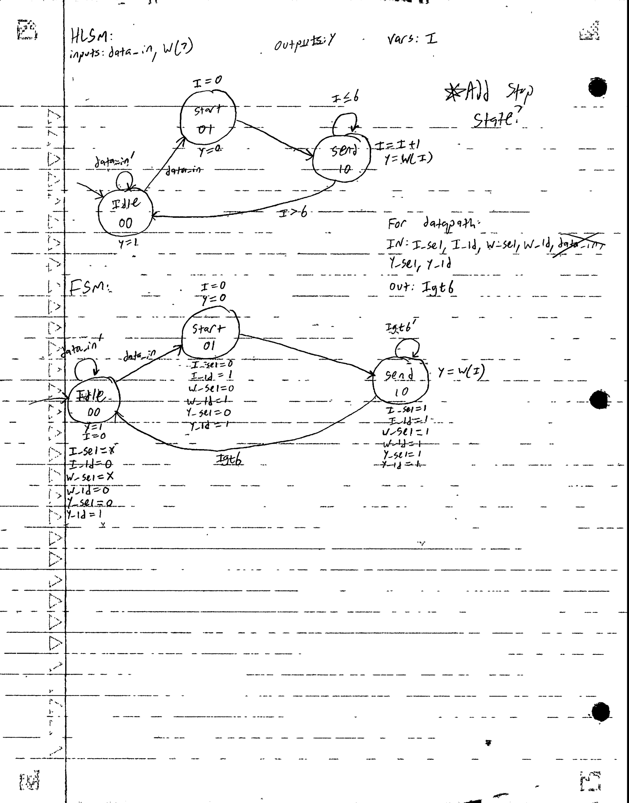

# Valmis Mk. 1

## Project Goal
The goal of Valmis Mk. 1 is to develop a UART transmitter capable of transmitting 7-bit ASCII characters. The Valmis Mk. 1 will be designed on paper, developed with VHDL in Vivado, and then it will be flashed onto an FPGA. The switches on the FPGA can be used to configure the ASCII character, and another switch is used to send it. The FPGA will be connected to a computer to display the output.

## What is a UART?
UART stands for universal asynchronous receiver/transmitter, and it is a protocol for sending information from one device to another. Specifically, UARTs send ASCII characters. For example, if someone wanted to use a UART to send "Hi" from one device to another, they would send two ASCII letters: 01001000 (H) and 01101001 (i). However, a transmitting UART sends ASCII letters in reverse by starting with the LSB rather than the MSB. This way, a receiving device catches the LSB first and the MSB last, allowing it to receive the ASCII letter in the correct form. Also, a UART does not only send the ASCII letters themselves. Rather, it must indicate when it is stopping or starting. So, an idling UART that is not sending any ASCII letters will constantly send a 1. To indicate that it is beginning a letter, it sends a 0. This is the start bit. Once the letter is done, it sends a 1 to indicate that it is finished. After, the UART continuously sends 1 until it is ready to repeat the process and send another letter. So, sending "Hi" would actually look like this:

1...10 00010010 10 10010110 1...

So, there are continuous 1s to indicate idling followed by a 0 start bit, then the reverse ASCII for H, followed by another stop bit and start bit. Then, the transmitter sends reverse ASCII for i, and it resumes idling, indicated by constant 1s again. 

Furthermore, UARTs are asynchronous, meaning that they are not synchronized with a device's clock when they send data. Rather, UARTs use baud rates, which dictate how quickly bits are sent. This way, two devices with different internal clocks can communicate with each other so long as they are operating at the same baud rate. Along with this, another one of UART's strengths is that it only requires two wires: TX to transmit and RX to receive. Each device connects its own TX pin to the other's RX pin.

## Sketch Design
When designing a digital circuit, the first step is to make a sketch or multiple sketches. For basic sequential circuits, the best first sketch to make is often an FSM. However, standard FSMs are not capable of certain functions that more advanced digital circuits like a UART demand. Instead, this design must start with a sketch of a high-level state machine (HLSM).

### HLSM
HLSMs are like FSMs, only more advanced. Like FSMs, HLSM sketches feature bubbles that represent different states, conditions to either stay at a state or move between them, and different outputs based on the present state. Unlike FSMs, though, HLSMs are capable of storing variables, manipulating data, comparing numbers, and other more sophisticated functions. 

Before making the HLSM, though, engineers should first clearly identify their design's functions based on the project goal, and they should have a clear and well thought-out plan. Doing this step first makes designing an HLSM substantially easier. So, I started by identifying the inputs and outputs of the transmitter. First, there is only one one-bit output, I called this y. y is one bit because a serial transmitter like this one only sends one bit at a time. Second, there are two inputs: a 7-bit ASCII word, I called this W, and a one bit ON/OFF input to send W, which I called data_in. With these inputs and outputs identified and standard UART serial transmitter behavior in mind, we can already reason that this transmitter must take the 7-bit input W and send each bit one at a time starting from the LSB, W(0), when data_in goes HIGH.

I continued by conceptually decomposing my transmitter plan into three core functions based on how UART transmitters work: first, UART transmitters continuously send 1s when they are idle. Second, they transmit exactly one 0 to act as a start bit and indicate to a receiver that data is coming. Third, the data is sent bit by bit. After that, the transmitter must, no matter what, return to an idle state and send repeating 1s again for at least one baud cycle. From there, it can either stay idle and continue to send 1s or send the 0 start bit and transmit once more. So, I took these three discrete functionalities and allocated a state and output for each. I plotted an "IDLE" state as the initial state where `y=1`. This represents the idle behavior where 1s are continuously sent. From IDLE, inputting data_in' causes the HLSM to loop back to IDLE, and data_in moves to the next state. The second state is "START", which is meant to handle the start bit. So, `y=0` in START. Here, it does not matter whether data_in is HIGH or LOW; the HLSM will begin to send W regardless. So, the HLSM always goes to the third state from START. I called this third state "SEND" and dedicated it to sending W. However, because the transmitter must send W one bit at a time starting from its LSB, there is no single y output that can be assigned to SEND. That is, unless the transmitter is being designed to send exactly one ASCII letter that is either 1111111 or 0000000. For example, if I were to decide that `y=1` at SEND, it would be impossible to send ASCII letters that contain zeros. 

Up until now, this design has been no different from that of an FSM. But, an FSM alone is not reasonably capable of the functionality that this transmitter needs. This is where the utility of HLSMs begins to show itself. Because W has multiple bits that vary between 1 and 0, the solution is to introduce a variable. So, I decided to set y equal to W(I), where I is the nth bit of W. I also added another output of the SEND state: `I = I + 1`. By doing this, the output y can increment the digit of W it sends each time. For example, the transmitter could first send the 0th bit of W by setting `y = W(0)`, loop to SEND again, send `y = W(1)`, loop to SEND again, send `y = W(2)`, and continue this way until it reaches W(6), the final bit of W. This way, I increases by one each time SEND loops to itself. However, this only works if I begins at 0. So, I went back to the START state and included `I = 0` as one of its behaviors.

Of course, the natural next question is "How does the controller know to loop at SEND until all seven bits of W have been sent?" Again, the solution lies with I. `I = 0` sends W(0), the first bit of W, `I = 1` sends W(1), the second bit of W, and `I = 6` sends W(6), the seventh and final bit of W. Any I value greater than `I = 6` therefore cannot be used the same way the first seven I values can. So, the controller can know when to stop looping SEND by observing whether I is greater than 6. So, I introduced a new input to the controller called "Igt6". From SEND, the controller will loop back to SEND when Igt6' is inputted, and it will move from SEND to IDLE when Igt6 is inputted. With this, the HLSM is finished. My sketch of the initial HLSM and the FSM are below:

### Datapath
After the HLSM is made, the next step is to use it to design a datapath. Similar to how an FSM can be translated into a controller and state register, an HLSM can be translated into a datapath, controller, and state register. The datapath is responsible for the outputs and variables of the HLSM. In this case, it must do two things. First, it must increment the variable I starting from 0 and send a signal "Igt6" when I is greater than six. Second, it must output W in the correct format. These two functions will make up two distinct zones in the datapath, and it is best to start with the I zone because it is easier. 

The zone for I uses four different components that connect together like a tree. First, at the very top, I placed a three bit 2x1 multiplexer. I called this the "I mux" and, and I added a new output to the controller called "I_sel", which I connected to the select line of the I mux. This way, the controller controls the output of the mux. I chose three bits for this mux because any I values after the largest possible binary number, 111 (7 in decimal), are not important for this digital circuit. Next, the inputs of this mux must either be zero, which is chosen in the START state by `I = 0`, or `I = I + 1`, which is chosen in the SEND state. So, I connected 000 to i1 of the mux. Before approaching the second input, `I + 1`, I connected the output of this mux to a register. Then, I recorded another output of the controller and called it "I_ld". I_ld is connected to I's register and controls whether it loads new values or not. Because the value of I changes as the HLSM moves between states, variable I must have a register just as the binary state digits of an FSM must. In fact, inputs, outputs, and variables in datapaths usually require their own registers. Then, I connected the output of this register to two separate components. First, I connected it to an incrementer. I then connected this incrementer's output back to i0 of the mux. This way, to output `I = I + 1`, the controller can simply choose i1, `I = 0`, then it can choose the incrementer's output, which is `0 + 1 = 1`. The controller can simply repeat this process until I reaches 7. As for the register's output's other connection, I used a three bit comparator. The first input of this comparator is, of course, I, and I connected 110 (six in decimal) as the other input. When I is greater than six in binary, the comparator outputs the signal "Igt6" to the controller. With this, I's branch of the datapath is finished.

The branch for W is larger, and it again begins with a 2x1 mux. However, this mux is seven bits rather than three. On the left side, for input i1, I connected W(7) and created another output of the controller called "W_sel" to drive this mux's select line. Then, I fed the output of this mux to a register for W. Just like I's register, I created a new output of the controller called "W_ld" that is responsible for loading a new value to the W register. 

### FSM

### Controller

## VHDL Design

### Datapath

### Controller

### Baud Rate Controller

### Full Transmitter Design

## Testing on FPGA

## Tutorial for Use

## Problems and Headaches
- bit width in testbench (building muxes for different widths) (wip)
- y is one cycle behind in waveform (not technically a bug) (wip)
- unneeded edge detector in y mux
- needed edge detector for human use

## What Did I Learn?