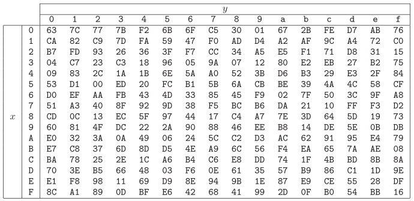

# AES-128 Hardware Encryption Core

## Project Goal
The goal of this project is to design an AES-128 encyrption core at the register-transfer level and then implement it in Vivado with Verilog. I will design the key schedule first, test it, and then I will design the rest of the encyrption core and test capabilities along the way as needed. Once the entire core is finished, I will use a testbench to verify correct encyrption consistent with the AES-128 model.

## How Does AES-128 work?
AES-128 is a powerful encryption algorithm first published in 1998 that is widely used today by many entities such as the U.S. Government. AES stands for "advanced encryption standard", and it encrypts 128 bits of information at a time. The pre-encyrpted information is called "plaintext". Additionally, the encrypted result that AES outputs, called "ciphertext", is determined by the encyrption key used. As for the key, it is a string of data that can be either 128, 192, or 256 bits long. These different key lengths are used by AES-128, AES-192, and AES-256, respectively, and greater key lengths result in a more complex, safer ciphertext. However, the plaintext and ciphertext are always 128 bits, no matter the size of the key.

AES-128 uses a series of operations in rounds to encrypt the plaintext. These operations are KeyExpansion, AddRoundKey, SubBytes, ShiftRows, and MixColumns. The number of rounds is based on the key, being either 10, 12, or 14 for AES-128, AES-192, and AES-256, respectively. AES encrypts by first applying AddRoundKey. Then, round 1 begins. In round 1, AES first applies SubBytes, then ShiftRows, then MixColumns, and then another instance of AddRoundKey. Next, AES simply repeats this process for the number of rounds specified by the key length. On the very last round, though, AES does not apply MixColumns. Instead, the final round only includes SubBytes, ShiftRows, and AddRoundKey because MixColumns in this round does not make the ciphertext any more or less secure. The result of the last round is the fully-encrypted ciphertext. 

Additionally, AES uses another operation called KeyExpansion, which is done by something called the key schedule. This operation uses the initial key to create 10, 12, or 14 more round keys that are used to encrypt the plaintext. In AES-128, for example, the key schedule supplies 11 different round keys, and each one is used in the operation AddRoundKey. For example, the first round key, the initial key, is used in AddRoundKey before round 1 begins. Then, the second key is used in round 2's instance of AddRoundKey, and so on until the 11th round key is used in round 10. When designing an AES encryption core, engineers can choose for the KeyExpansion process to be either fully completed before any encryption is done, or they can choose for it to expand the key as the rounds of the encyrption process progress. For this project, I will choose the former option.

## KeyExpansion

### Setup
AES uses KeyExpansion to expand the starting key into 11, 13, or 15 total round keys depending on the starting key's length. These round keys are used by the AddRoundKey function as part of the encryption process. Since this project uses a 128-bit key consistent with AES-128, I will design KeyExpansion to expand the starting key into 10 more round keys, resulting in a total of 11 round keys for the 11 instances of AddRoundKey that occur in AES-128. Before expanding, AES operations are described with bytes. So, it is better to visualize the 128-bit key as a 16-byte key, instead. This way, the key can be represented as:

$$
K = K_0\ K_1\ K_2\ K_3\ K_4\ K_5\ K_6\ K_7\ K_8\ K_9\ K_{10}\ K_{11}\ K_{12}\ K_{13}\ K_{14}\ K_{15}
$$

Alternatively, the key could be represented as a 4x4 matrix called the "key array". This notation is useful because linear algebra is essential to AES, and this notation is especially useful for understanding the AddRoundKey operation in the encryption process.

$$
K =
\begin{bmatrix}
K_0 & K_4 & K_8 & K_{12} \\
K_1 & K_5 & K_{9} & K_{13} \\
K_2 & K_6 & K_{10} & K_{14} \\
K_3 & K_7 & K_{11} & K_{15} \\
\end{bmatrix}
$$

Next, the key is further rephrased into a set of four 32-bit words. Each word occupies its own column in the key array.

$$
K = W_0\ W_1\ W_2\ W_3
$$

$$
K =
\begin{bmatrix}
W_0 & W_1 & W_2 & W_3 \\
\end{bmatrix}
$$

After the initial key array is complete, KeyExpansion expands this matrix into a larger one called the "expanded key array", which has four rows and $N_b(N_r + 1)$ columns, where $N_b$ represents the number of bits in the plaintext divided by 32, and $N_r$ represents the number of rounds. Since this project uses AES-128, $N_b$ is equal to 128 divided by 32, which is 4, and there are 10 rounds. So, $N_b(N_r + 1)$ is equal to 4 times 11, which is 44. So, the expanded key array is a matrix that has four rows and 44 columns, resulting in a total 176 entries. Because the expanded key array houses all 11 round keys to be used in the encryption process, this configuration can alternatively be viewed as 11 separate key arrays whose columns are attached to each other, one array per instance of AddRoundKey. The first array is to be used for the first instance of AddRoundKey, the second for the second instance of AddRoundKey, and so on. 

$$
K =
\begin{bmatrix}
K_0 & K_4 & K_8 & K_{12} & K_{16} & ... & K_{172} \\
K_1 & K_5 & K_{9} & K_{13} & K_{17} & ... & K_{173} \\
K_2 & K_6 & K_{10} & K_{14} & K_{18} & ... & K_{174} \\
K_3 & K_7 & K_{11} & K_{15} & K_{19} & ... & K_{175} \\
\end{bmatrix}
$$

The leftmost 4 columns of the 44-column expanded key array contain the original, first key, and the next 10 round keys generated by KeyExpansion are all derived from this first key. However, it is more standard to represent the expanded key array as a 1x44 matrix whose elements are 32-bit words rather than single bytes, as this representation makes it easier to understand and follow the method KeyExpansion uses to generate the 10 new round keys. Each individual group of four columns in this matrix represents a round key.

$$
K =
\begin{bmatrix}
W_0 & W_1 & W_2 & W_3 & W_4 & W_5 & ... & W_{43} \\
\end{bmatrix}
$$

Columns 1, 2, 3, and 4 make up the initial key, and the remaining columns make up the 10 additional round keys. 

### Recursion Function
The elements of columns 5 through 44 of the expanded key array are generated recursively based on the contents of the first four columns, and this recursion function has two possible behaviors depending on the index, i, of the column. For AES-128, column i is equal to column i-4 XOR column i-1 if i is not a multiple of 4, and column i is equal to column i-4 XOR g(column i-1), where g is a specific non-linear function, if i is a multiple of 4. For all integer values of i greater than or equal to 4 and less than or equal to 44, this can be expressed as the following piecewise equation:

$$
W_i =
\begin{cases}
W_{i-4} \oplus W_{i-1} & \text{if } i \not\equiv 0 \pmod 4 \\
W_{i-4} \oplus g(W_{i-1}) & \text{if } i \equiv 0 \pmod 4
\end{cases}
$$

The non-linear function, g, is essential to the strength of AES-128, which would be trivially breakable without it. The function g consists of three stages: RotWord, SubWord, and an XOR with a number called the round constant, or, Rcon.

### RotWord
The first step of g is to apply RotWord, which rotates the four-byte round key word one byte to the left.

$$
\mathrm{RotWord}([W_0, W_1, W_2, W_3]) = [W_1, W_2, W_3, W_0]
$$

### SubWord
The next step is SubWord, which applies an S-box, also known as $S_{RD}$, function to each element of the newly rotated round key word. The $S_{RD}$ function takes a four-byte input represented as a two-digit hexadecimal number and converts it to a new one using a galois field $GF(2^8)$. The exact discrete math of the S-box transformation and its galois field is beyond the scope of this project, and this function can instead be used with a table:



This table shows the possible outputs of the function $S_{RD}(xy)$, where x is the first hexadecimal number, and y is the second one. After applying the S-box transformation to the rotated round key, the new output is:

$$
\mathrm{SubWord}([W_1, W_2, W_3, W_0]) = [S_1, S_2, S_3, S_0]
$$

There is no need to implement the true $S_{RD}$ function. Instead, all of its outputs will be stored in a lookup table.

### XOR with Round Constant
Now that SubWord is complete, the next step is to perform a bitwise XOR of each element of the four-byte round key with something called a round constant. Shown below is the vector corresponding to the ith round constant.

$$
\begin{bmatrix}
\text{Rcon}_i \\
\texttt{0x00} \\
\texttt{0x00} \\
\texttt{0x00}
\end{bmatrix}
$$

Here, the round constant is denoted by $Rcon$ and, because the second, third, and fourth entries of the round constant matrix are zero, this XOR operation only affects the first element of the four-byte round key word. Furthermore, there are 10 separate round constants for the 10 different appearances of the non-linear function g in the key schedule. Like the S-box, the round constant comes from the Galois field $GF(2^8)$. Also like the S-box, the math behind the round constant is beyond the scope of this project because the round constant values are already known. Instead of designing the functionality to calculate each round constant, I will simply design my encryption core to retrieve any of the 10 possible round constants with a multiplexer.

The 10 different round constant values are: `0x01`, `0x02`, `0x04`, `0x08`, `0x10`, `0x20`, `0x40`, `0x80`, `0x1B`, `0x36`.

This is the final step of the function g, which is essential to this cipher because of its non-linear nature.

## Round Structure
Before it has become ciphertext, the collection of plaintext bits being encrypted is called the "state". Like the key and the expanded key, which are organized into a key array and an expanded key array, the state is given a state array. Furthermore, AES encrypts a 128-bit plaintext, the state array has four rows and four columns, and each element of this array is one byte. 

AES-128 performs 10 rounds of encryption on this state array, and each round contains four encryption operations in order: SubBytes, ShiftRows, MixColumns, and AddRoundKey. Before the first round of encryption comes, there is an additional instance of AddRoundKey. Hence, AddRoundKey is called 11 times for the 11 round keys outputted by KeyExpansion. Furthermore, The final round does not include MixColumns. Instead, the order includes: SubBytes, ShiftRows, and AddRoundKey.

## AddRoundKey
The first operation applied to the state in the encryption process is called "AddRoundKey", which consists of a bitwise XOR of the state with a round key. Shown below, the state array has elements $a_{m x n}$, the round key array has elements $K_{m x n}$, and the output array has elements $b_{m x n}$. For each matrix depicted, an entry corresponds to one byte.

```math
\begin{bmatrix}
a_{00} & a_{01} & a_{02} & a_{03} \\
a_{10} & a_{11} & a_{12} & a_{13} \\
a_{20} & a_{21} & a_{22} & a_{23} \\
a_{30} & a_{31} & a_{32} & a_{33}
\end{bmatrix}
\oplus
\begin{bmatrix}
K_{00} & K_{01} & K_{02} & K_{03} \\
K_{10} & K_{11} & K_{12} & K_{13} \\
K_{20} & K_{21} & K_{22} & K_{23} \\
K_{30} & K_{31} & K_{32} & K_{33}
\end{bmatrix}
=
\begin{bmatrix}
b_{00} & b_{01} & b_{02} & b_{03} \\
b_{10} & b_{11} & b_{12} & b_{13} \\
b_{20} & b_{21} & b_{22} & b_{23} \\
b_{30} & b_{31} & b_{32} & b_{33}
\end{bmatrix}
```


## SubBytes
SubBytes is the first operation in each round of encryption and, like the function SubWord in KeyExpansion, it is a non-linear transformation that uses the S-box. It works by

## ShiftRows

## MixColumns

## Design Approach

### KeyExpansion Design

### AddRoundKey Design

### SubBytes Design

### ShiftRows Design

### MixColumns Design
